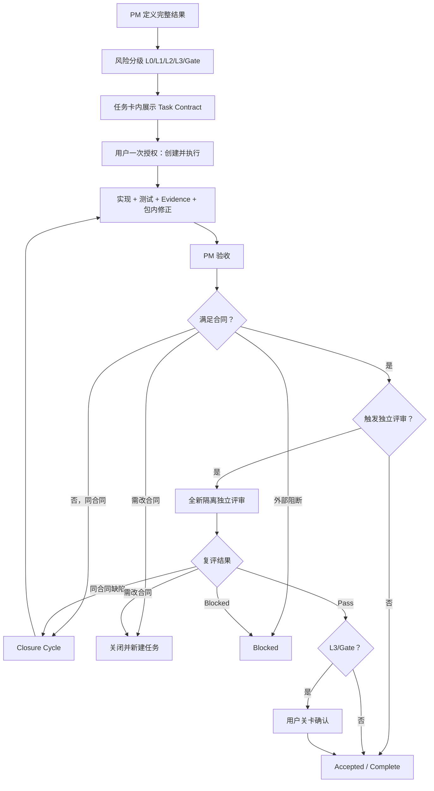

# LifeOS 轻量风险分级治理流程 V2.0

生效决策：D-0516
生效日期：2026-08-26

## 目标与适用边界

本流程用“一次任务授权、结果级任务、风险分级 Evidence、条件触发独立评审”替代重复确认和微任务链，同时保留数据主权、失败关闭、历史保全和重大动作用户控制。

- 适用于 D-0516 后新建的任务。
- 已执行、已关闭、已采纳或已冻结的历史任务不追溯改写。
- P3-127 已冻结，继续按 `ABF-P3-127-v1` 执行；其后新任务采用 V2。
- 任务优先级 P0/P1/P2 表示问题严重性；本文件 L0/L1/L2/L3/Gate 表示治理风险等级，两者不得混用。

## 长期产品质量原则

以下原则始终有效，但 PM 必须用具体条款、事实和严重级别裁决，不得作为移动验收终点的笼统理由：

1. 数据主权：不得越出用户授权的数据、目录、目标和能力边界。
2. 内容身份：用户原文、外部来源、AI 派生、系统状态和确认事实不得混淆。
3. 生命周期完整：创建、读取、更新、删除、失败、恢复和重启语义一致。
4. 失败关闭：失败不得留下矛盾持久化、页面、缓存、sidecar 或半成品。
5. 用户控制：重大、不可逆、权限或外部动作必须明确确认。
6. 审计可信：来源、时间、顺序、数量、动作和结果真实可追溯。
7. Evidence 诚实：PASS 来自实际证据，不由汇总、静态扫描或相邻动作推定。
8. 历史保全：不得覆盖历史 Review、Evidence、Manifest 或只读资产。
9. 授权不漂移：工具、会话和重跑不得扩大任务合同。
10. 可复核性：固定候选和夹具应得到一致、可解释结果。

## 一次性 Task Contract

每张新任务卡必须在用户授权前完整展示一个简短 Task Contract：

1. 唯一用户结果。
2. 允许修改的范围和资产。
3. 明确禁止范围。
4. 关键不变量与 Pass 条件。
5. 风险等级、Evidence 等级、独立评审触发条件和新任务触发器。

普通任务不再单独创建 ABF。Task Contract 是本轮验收依据，直接嵌入任务卡。

用户在完整 Task Contract 已展示且未变化时回复“创建”“采纳并创建”“开始”或将最终任务卡路径投递到指定专项会话，默认一次性授权创建、启动、实现、测试、动态验证、Evidence、包内修正和 PM 验收。

不得让一次性授权覆盖当时尚未展示的边界。Task Contract 在授权后如发生实质变化，必须重新取得一次确认；不因措辞、测试补充或 Evidence 路径整理重复确认。

## 仍需单独确认的动作

只有以下新增或即将发生的实际动作需要独立确认：

- 读取或写入真实个人数据、真实 DB、真实用户目录或真实文件；
- 删除、覆盖、迁移、清理不可恢复资产或其他不可逆动作；
- 网络、云、第三方、同步、多设备或外部用户；
- 权限扩大、导出、凭据、Vault 或安全边界变化；
- 风险关闭／重开、关键资产冻结、工程基线恢复、Schema/API 关键合同变化；
- Stage 切换或真实能力启用。

任务卡已在授权前逐项完整展示的高风险边界，可由同一次“创建并执行”确认覆盖；执行中不得再次机械请求同内容。

## 任务粒度

任务默认以一个完整、可验收的用户或工程结果为单位，并在同一任务内包含实现或设计、自动测试、必要动态验证、Evidence、包内修正和 PM 验收所需复跑入口。

测试补齐、Evidence 整理、Manifest 修复、同范围失败关闭修正和文案对齐不得单独拆成微任务。

只有出现以下情况才新建任务：

- 用户结果或产品能力变化；
- 数据类型、真实目标、入口、权限或风险边界变化；
- 架构、Schema/API、核心领域语义或冻结合同变化；
- 当前任务历史、候选或 Evidence 已污染且无法可信恢复；
- 新问题不属于当前完成定义，只是后续改进；
- Closure Cycle 后继续完成必须修改 Task Contract。

## 风险等级与 Evidence

| 等级 | 典型范围 | Evidence 要求 | 独立评审 |
|---|---|---|---|
| L0 | 文案、静态样式、内部文档、机械整理 | 简短自检或 diff 摘要 | 不需要 |
| L1 | 合成数据、本地 UI、普通逻辑、非破坏性接口 | 测试结果和关键日志／截图 | 默认不需要，可抽检 |
| L2 | 数据生命周期、路径边界、本地持久化、失败关闭 | 结构化结果、正负路径、重复／重启 Evidence | PM 判断，非默认 |
| L3 | 真实数据、删除、迁移、权限、导出、网络、同步、安全边界 | 逐行矩阵、Manifest、hash、mutation、清理证明 | 强制 |
| Gate | 风险关闭、关键冻结、真实用户启用、Stage 切换 | L3 Evidence 加关卡材料 | 强制 |

PM 可因下列事实把 L1/L2 升级为需要独立评审：PM 无法复算关键 Evidence；执行会话、候选或 Evidence 出现污染／越权；候选将成为长期冻结基线；Closure Cycle 后关键结论仍有争议；用户明确要求。PM 必须记录原因，不得仅因任务编号、P0 标签、Tauri/IPC 或历史惯例自动要求独立评审。

## Acceptance Contract 与 ABF

- L0/L1/L2：使用任务卡内嵌 Acceptance Contract，不单独生成 ABF 或冻结 Manifest。
- L3/Gate：使用独立 ABF，固定版本、hash、关键输入和逐行矩阵。
- 独立评审任务：引用原 Task Contract／ABF，不重复制造同义确认。
- 测试或 Evidence 补强只要不改变用户结果、范围和 Pass 公式，不构成合同变化。

## PM 验收和用户采纳

- 普通 L0/L1/L2：PM Pass 后自动记为 `Accepted / Complete`，无需用户逐任务回复“采纳”。
- L3/Gate、产品方向、关键冻结、风险关闭、真实能力启用和 Stage 切换：PM Pass 后等待用户最终确认。
- Rework／Blocked 只有在需要用户选择、扩大授权或改变路线时才要求采纳；纯工程同范围修正不重复请求授权。
- Accepted 不自动等于 Frozen、风险关闭或 Stage 准入。

## Closure Cycle、Blocked 与新任务

执行侧提交 PM 前的同范围修正属于包内工作，不计 Rework。

PM 首次正式验收未通过时，应一次性列出当前合同内全部已知阻断项，进入一次 `Closure Cycle`。同一结果、范围、数据、风险、入口和架构不变时，可继续在原任务内修改实现、测试和 Evidence，无需用户重复授权；历史 Review/Evidence 只读保全。

Closure Cycle 后：满足合同则 Pass；仍可在同一合同内安全修复则保持 `In Progress`，PM 可决定继续或停止；必须修改合同或扩大边界则关闭并新建任务；缺少外部条件、工具或输入则 `Blocked`；仅后续改进进入 Backlog，不阻断当前 Pass。

不再使用统一“两轮 Rework 上限”作为机械终止条件。PM 根据合同是否变化和 Evidence 是否仍可信决定继续或新建任务。

## 模型与执行环境

- 新任务卡不填写推荐模型、推理强度、降级模型或后备模型。
- 模型选择属于执行环境细节，不是产品验收门禁，不要求用户证明或 PM 验收。
- 任务卡只描述需要的能力，例如本地文件、测试、actual Tauri、离线运行或视觉操作。
- 无论使用何种模型，都不得扩大授权、降低 Evidence 或改变独立性要求。
- 历史任务中的模型字段和相关结论只读保留，不追溯改写。

## 标准流程

## 状态口径

- `Draft`：合同尚未完整展示或尚未授权。
- `Ready / In Progress`：用户一次授权已覆盖任务合同。
- `Closure Cycle`：PM 已一次性列明同合同缺口，原任务内收口。
- `Blocked`：必要外部条件不可用。
- `Closed — Acceptance Not Met`：任务结束但未满足合同。
- `Superseded`：合同或边界改变，由新任务接替。
- `Accepted / Complete`：满足合同；不自动等于 Frozen、风险关闭或 Stage 准入。
