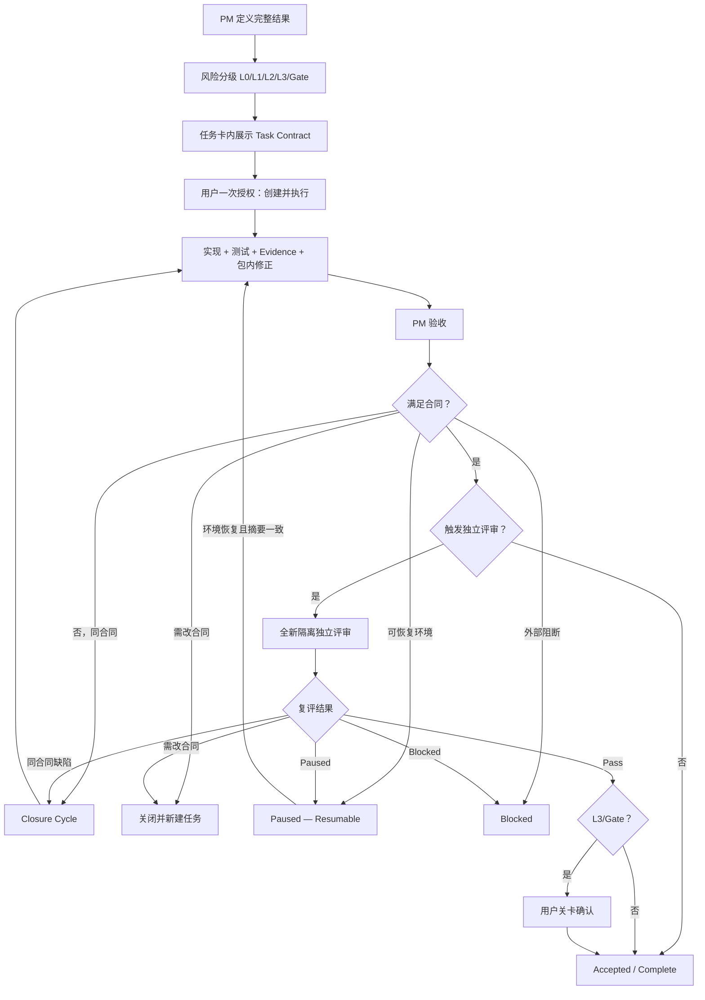

# LifeOS 轻量风险分级治理流程 V2.1

生效决策：D-0516；D-0635 增加 CI/CD 与可恢复执行
生效日期：2026-09-01

## 目标与适用边界

本流程用“一次任务授权、结果级任务、风险分级 Evidence、条件触发独立评审”替代重复确认和微任务链，同时保留数据主权、失败关闭、历史保全和重大动作用户控制。

- 适用于 D-0516 后新建的任务。
- 已执行、已关闭、已采纳或已冻结的历史任务不追溯改写。
- P3-127 已冻结，继续按 `ABF-P3-127-v1` 执行；其后新任务采用 V2。
- 任务优先级 P0/P1/P2 表示问题严重性；本文件 L0/L1/L2/L3/Gate 表示治理风险等级，两者不得混用。

## 长期产品质量原则

以下原则始终有效，但 PM 必须用具体条款、事实和严重级别裁决，不得作为移动验收终点的笼统理由：

1. 数据主权：不得越出用户授权的数据、目录、目标和能力边界。
2. 内容身份：用户原文、外部来源、AI 派生、系统状态和确认事实不得混淆。
3. 生命周期完整：创建、读取、更新、删除、失败、恢复和重启语义一致。
4. 失败关闭：失败不得留下矛盾持久化、页面、缓存、sidecar 或半成品。
5. 用户控制：重大、不可逆、权限或外部动作必须明确确认。
6. 审计可信：来源、时间、顺序、数量、动作和结果真实可追溯。
7. Evidence 诚实：PASS 来自实际证据，不由汇总、静态扫描或相邻动作推定。
8. 历史保全：不得覆盖历史 Review、Evidence、Manifest 或只读资产。
9. 授权不漂移：工具、会话和重跑不得扩大任务合同。
10. 可复核性：固定候选和夹具应得到一致、可解释结果。
11. 已确认能力不回退：用户已经明确确认或采用的产品行为，后继任务不得静默删除、隐藏、合并、改名、降级或用更弱替代方案覆盖。
12. 用户原始确认优先：PM摘要、任务卡、ABF或长合同若与可定位的用户明确产品确认冲突，以用户明确确认为纠错依据；必须新增决策修正，历史记录只读保留。

## 已确认基线继承与防回退

- PM创建任何后继或组合任务前，必须列出直接继承的已确认产品基线，并逐项形成`baseline lineage matrix`。
- 对已确认能力的删除、合并、替换或降级必须在授权前作为单独的显式delta展示；不得埋入长Task Contract并用笼统“确认完整合同”取得授权。
- 工程候选必须对继承基线做语义回归测试；字符串存在、相邻能力或旧截图不能代替。
- PM验收必须核对用户可见行为、数据生命周期和安全策略三类谱系。任何一类回退均不得以“本轮未改该模块”或“沿用旧候选”为由放行。
- 后继任务如确需改变基线，必须先取得用户对精确delta的明确确认，并新增Decision；原基线和旧Evidence只读保留。
- 若Pass后发现任务／ABF遗漏了更早的明确用户确认，立即撤回该Pass的当前正向效力、暂停后续真实阶段，并以新Revision或明确后继任务纠正；不得追溯伪造旧验收。

## 累积产品与增量交付（D-0648）

用户于2026-09-09明确确认：后续开发必须继承完整产品工程，在其基础上新增；不得逐任务重新拼装缺失既有能力的App。本条细化已确认能力不回退，不改变架构、真实权限、冻结或Stage。

1. **一个产品、增量开发**：PM指定可定位的累积产品源码基线及版本（commit；未提交时用受控源码清单摘要），并列明视觉权威、已确认功能和当前真实授权。不得仅凭最大任务号、最近一个能启动的样机、CSS摘要相同推定完整基线。
2. **隔离的是执行环境，不是产品能力**：允许worktree、独立分支、只读快照和合成构建；候选须继承完整基线并可说明差异。禁止只复制当前任务所需模块、重写精简Shell或设置页，然后作为完整产品交付。历史快照可保留，但不得成为互不集成的平行产品。
3. **任务卡必填继承清单**：基线路径/版本、产品构建入口、继承能力与行为、允许delta、禁止回退项、回归方式及最终bundle来源。未知项明确待核对；不能把未知填为已继承。产品主线存在缺口时先列事实和最小接回方案，不自行挑一个缺失版本宣布为权威。
4. **功能与视觉都继承**：包括导航、页面结构、交互、Provider选项、配置保存/重启、数据生命周期及权限。仅留菜单/禁用全部选项不等于恢复已实现能力；未实现的旧占位也不得冒称真实可用。限单一Provider的真实发送不等于删除其他Provider本地配置。更改已确认内容须先展示明确差异并获用户确认。
5. **验收新增能力和已有能力**：以能力清单比较前后行为，用合成数据验证关键继承链路与影响面。UI核对实际页面结构和关键状态，不仅比较CSS；持久化检查保存及重启；安全策略检查失败关闭。可复用未受影响证据，不要求每次全历史重跑或新增独立评审。
6. **交付身份明确**：报告给出基线、增量、累积候选版本、构建入口与bundle对应关系，列出已保留/新增/授权变化/未验证项。测试样机必须标记，不能替代用户版本。打开用户版前核对其来自该累积候选，不覆盖运行App、不擅自关掉含草稿窗口或迁移用户数据。
7. **发现遗漏在同任务闭环**：因本任务遗漏/降级的既有能力属于回归缺陷，不以“本轮非范围”放行；暂停该候选的完整交付结论，同任务修正受影响部分。超出既有授权的迁移、权限或实质合同变化另报具体边界；不借此做全仓重构或无限追溯历史。

治理规则已生效不等于历史已完成累积集成。本次P3-152仍处UI与设置兼容修复，不能因本条新增而标记完整产品Pass。真实数据/凭据/网络授权和独立评审暂停状态不变。

## 核验顺序与证据适配（D-0649）

用户确认：代码比对与行为测试为主，截图仅辅助视觉检查。默认按以下顺序执行，不以增加截图数量替代查明工程差异：

1. 对照任务指定的累积基线，先检查源码及配置差异：组件/页面结构、导航路由、状态、设置字段、IPC接线、持久化和构建入口；检查删除、漏接和降级。不能只比CSS、hash或字符串存在，也不能把代码静态检查当作实际行为通过。
2. 根据变更及共享依赖选择自动单元/集成/必要端到端测试，覆盖新增与受影响的原有行为、保存/重启、权限及失败路径。报告给出差异→影响→测试的对应关系，说明未覆盖项。
3. 只有存在视觉影响时补充少量合成视觉核验：遮挡、排版、响应式、缩放、可达性及必要交互状态。截图不能证明配置保存、IPC有效、权限安全或产品功能完整；代码相同亦不能独自证明渲染正常。无视觉影响写明依据，可不新增截图。
4. 未受影响证据可复用，须说明代码、共享样式/组件、运行依赖与构建差异的影响；不能机械每轮重拍全部页面或重跑全历史。证据不足时补受影响检查，不追溯伪造通过。
5. 显式Frozen/历史合同中的特定动态Gate不因本规则被静默豁免；冲突单列，由PM按既有权限处理。当前独立评审暂停不因此恢复。真实数据窗口仍禁止未经授权截图/AX采集，使用合成数据验证视觉。

PM验收应分别记录代码检查、行为测试、视觉必要性/结果及复用依据。核验规则已生效不等于CI自动覆盖已实现，不据此关闭风险或宣布任务Pass。

## 一次性 Task Contract

每张新任务卡必须在用户授权前完整展示一个简短 Task Contract：

1. 唯一用户结果。
2. 允许修改的范围和资产。
3. 明确禁止范围。
4. 关键不变量与 Pass 条件。
5. 风险等级、Evidence 等级、独立评审触发条件和新任务触发器。

普通任务不再单独创建 ABF。Task Contract 是本轮验收依据，直接嵌入任务卡。

用户在完整 Task Contract 已展示且未变化时回复“创建”“采纳并创建”“开始”或将最终任务卡路径投递到指定专项会话，默认一次性授权创建、启动、实现、测试、动态验证、Evidence、包内修正和 PM 验收。

不得让一次性授权覆盖当时尚未展示的边界。Task Contract 在授权后如发生实质变化，必须重新取得一次确认；不因措辞、测试补充或 Evidence 路径整理重复确认。

## 仍需单独确认的动作

只有以下新增或即将发生的实际动作需要独立确认：

- 读取或写入真实个人数据、真实 DB、真实用户目录或真实文件；
- 删除、覆盖、迁移、清理不可恢复资产或其他不可逆动作；
- 网络、云、第三方、同步、多设备或外部用户；
- 权限扩大、导出、凭据、Vault 或安全边界变化；
- 风险关闭／重开、关键资产冻结、工程基线恢复、Schema/API 关键合同变化；
- Stage 切换或真实能力启用。

任务卡已在授权前逐项完整展示的高风险边界，可由同一次“创建并执行”确认覆盖；执行中不得再次机械请求同内容。

## 任务粒度

任务默认以一个完整、可验收的用户或工程结果为单位，并在同一任务内包含实现或设计、自动测试、必要动态验证、Evidence、包内修正和 PM 验收所需复跑入口。

测试补齐、Evidence 整理、Manifest 修复、同范围失败关闭修正和文案对齐不得单独拆成微任务。

只有出现以下情况才新建任务：

- 用户结果或产品能力变化；
- 数据类型、真实目标、入口、权限或风险边界变化；
- 架构、Schema/API、核心领域语义或冻结合同变化；
- 当前任务历史、候选或 Evidence 已污染且无法可信恢复；
- 新问题不属于当前完成定义，只是后续改进；
- Closure Cycle 后继续完成必须修改 Task Contract。

## 风险等级与 Evidence

| 等级 | 典型范围 | Evidence 要求 | 独立评审 |
|---|---|---|---|
| L0 | 文案、静态样式、内部文档、机械整理 | 简短自检或 diff 摘要 | 不需要 |
| L1 | 合成数据、本地 UI、普通逻辑、非破坏性接口 | 测试结果和关键日志／截图 | 默认不需要，可抽检 |
| L2 | 数据生命周期、路径边界、本地持久化、失败关闭 | 结构化结果、正负路径、重复／重启 Evidence | PM 判断，非默认 |
| L3 | 真实数据、删除、迁移、权限、导出、网络、同步、安全边界 | 逐行矩阵、Manifest、hash、mutation、清理证明 | 强制 |
| Gate | 风险关闭、关键冻结、真实用户启用、Stage 切换 | L3 Evidence 加关卡材料 | 强制 |

PM 可因下列事实把 L1/L2 升级为需要独立评审：PM 无法复算关键 Evidence；执行会话、候选或 Evidence 出现污染／越权；候选将成为长期冻结基线；Closure Cycle 后关键结论仍有争议；用户明确要求。PM 必须记录原因，不得仅因任务编号、P0 标签、Tauri/IPC 或历史惯例自动要求独立评审。

## Acceptance Contract 与 ABF

- L0/L1/L2：使用任务卡内嵌 Acceptance Contract，不单独生成 ABF 或冻结 Manifest。
- L3/Gate：使用独立 ABF，固定版本、hash、关键输入和逐行矩阵。
- 独立评审任务：引用原 Task Contract／ABF，不重复制造同义确认。
- 测试或 Evidence 补强只要不改变用户结果、范围和 Pass 公式，不构成合同变化。

## PM 验收和用户采纳

- 普通 L0/L1/L2：PM Pass 后自动记为 `Accepted / Complete`，无需用户逐任务回复“采纳”。
- L3/Gate、产品方向、关键冻结、风险关闭、真实能力启用和 Stage 切换：PM Pass 后等待用户最终确认。
- Rework／Blocked 只有在需要用户选择、扩大授权或改变路线时才要求采纳；纯工程同范围修正不重复请求授权。
- Accepted 不自动等于 Frozen、风险关闭或 Stage 准入。

## Closure Cycle、Blocked 与新任务

执行侧提交 PM 前的同范围修正属于包内工作，不计 Rework。

PM 首次正式验收未通过时，应一次性列出当前合同内全部已知阻断项，进入一次 `Closure Cycle`。同一结果、范围、数据、风险、入口和架构不变时，可继续在原任务内修改实现、测试和 Evidence，无需用户重复授权；历史 Review/Evidence 只读保全。

Closure Cycle 后：满足合同则 Pass；仍可在同一合同内安全修复则保持 `In Progress`，PM 可决定继续或停止；必须修改合同或扩大边界则关闭并新建任务；缺少外部条件、工具或输入则 `Blocked`；仅后续改进进入 Backlog，不阻断当前 Pass。

不再使用统一“两轮 Rework 上限”作为机械终止条件。PM 根据合同是否变化和 Evidence 是否仍可信决定继续或新建任务。

## Paused — Resumable 与失效边界

环境条件暂不可用时，必须先区分“无法继续执行”和“候选不合格”。以下事实默认记为 `Paused — Resumable`：

- macOS锁屏、登录会话或前台窗口暂不可见；
- direct PID 已启动但 AXWindow／AXWebArea 暂未暴露；
- 截图服务、显示会话或本地 runner 暂不可用；
- 一次截图尺寸、裁切、窗口目标或渲染不合格，但未接触禁止数据／路径。

专项会话应在安全点停止 App、写入者和数据库连接，写入符合 `lifeos/templates/EXECUTION_CHECKPOINT_TEMPLATE.json` 的检查点。环境恢复后，若 Task Contract、候选和基线摘要未变化，历史 Evidence hash 一致，且没有禁止边界接触，则从 `resume_from` 继续，只重跑最早受影响阶段及其下游。

只有以下事实允许将本次 attempt 判为 `Irrecoverable Invalidation`：

- 接触任务明确禁止的路径、真实数据、网络、Provider或凭据；
- 修改只读候选、固定输入或历史 Evidence；
- 错误产物包含任务外真实信息，且无法证明已精确隔离、清除或与正 Evidence 分离；
- 授权边界被突破，或正 Evidence 的来源／候选身份已不可可信恢复。

即使评审／Evidence attempt 失效，也只重启受污染部分；不得自动要求重建未变化且有可信hash的工程候选。完整分类、检查点和恢复规则见 `lifeos/CI_CD_GOVERNANCE.md`。

## CI 与确认基线防回退

- 确认产品、架构和视觉基线登记在 `lifeos/ci/confirmed_baselines.json`，由 CI 校验 hash。
- 后续任务若合法改变确认基线，必须在同一变更中加入新的 PM 决策并更新基线登记；否则 CI 失败。
- D-0635 后新任务必须在 Task Contract 中声明 CI 检查清单、人工／环境 Gate、检查点阶段和最早受影响阶段重跑规则。
- CI 只执行合成、确定性、无真实数据／凭据／Provider的检查。桌面 GUI 与用户亲验属于可恢复人工 Gate，不因未在 CI 执行而失败。

## 模型与执行环境

- 新任务卡不填写推荐模型、推理强度、降级模型或后备模型。
- 模型选择属于执行环境细节，不是产品验收门禁，不要求用户证明或 PM 验收。
- 任务卡只描述需要的能力，例如本地文件、测试、actual Tauri、离线运行或视觉操作。
- 无论使用何种模型，都不得扩大授权、降低 Evidence 或改变独立性要求。
- 历史任务中的模型字段和相关结论只读保留，不追溯改写。

## 标准流程

## 状态口径

- `Draft`：合同尚未完整展示或尚未授权。
- `Ready / In Progress`：用户一次授权已覆盖任务合同。
- `Closure Cycle`：PM 已一次性列明同合同缺口，原任务内收口。
- `Evidence Closure`：候选不变，仅补齐或重取受影响 Evidence。
- `Paused — Resumable`：环境或工具暂不可用；已写检查点，可从 `resume_from` 继续。
- `Blocked`：必要外部条件不可用。
- `Invalidated Attempt`：当前 attempt 的可信度被不可逆破坏；不自动否定未受影响的候选或其他阶段。
- `Closed — Acceptance Not Met`：任务结束但未满足合同。
- `Superseded`：合同或边界改变，由新任务接替。
- `Accepted / Complete`：满足合同；不自动等于 Frozen、风险关闭或 Stage 准入。
