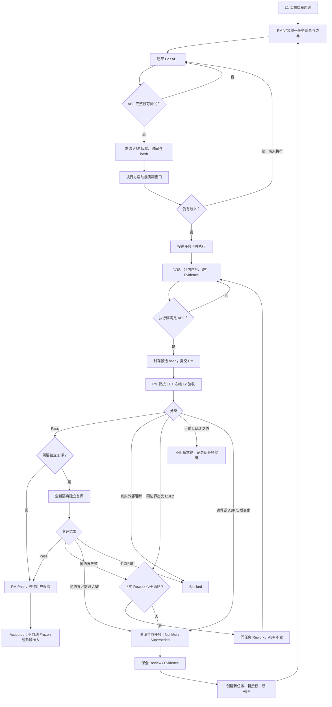

# LifeOS 两层验收治理流程 V1.0

生效决策：D-0401  
生效日期：2026-08-22

## 目标

本流程把验收标准拆为长期不变的产品质量原则和任务一次性冻结的验收依据。它不冻结产品需求，也不降低质量底线；它冻结的是某一任务、某一候选边界在本轮凭什么通过，防止验收依据在执行后无界扩张。

## 第一层：长期产品质量原则（L1）

L1 对所有任务持续有效，不因任务卡遗漏而失效：

1. 数据主权：不得越出用户授权的数据、目录、目标和能力边界。
2. 内容身份：用户原文、外部来源、AI 派生、系统状态和用户确认事实不得混淆。
3. 生命周期完整：创建、读取、更新、删除、失败、恢复和重启后的语义必须一致。
4. 失败关闭：失败不得留下与失败回执矛盾的持久化、页面、缓存、sidecar 或半成品。
5. 用户控制：重大、不可逆、权限或外部动作必须取得明确确认。
6. 审计可信：来源、时间、顺序、数量、动作和结果必须真实、可追溯且语义一致。
7. Evidence 诚实：每个 PASS 必须由实际执行产生，不得由汇总结果、静态扫描或相邻动作批量推定。
8. 历史保全：不得覆盖历史 Review、Evidence、Manifest 或任务指定的只读资产。
9. 授权不漂移：任务、会话、模型、工具和重跑不得继承或扩大未明确授权的范围。
10. 可复核性：同一候选 hash、固定夹具和复跑入口应得到一致、可解释的结果。

PM 可以在任何验收中依据 L1 判定失败，但必须指明具体条款、可复现事实和严重级别。L1 不得被用作没有证据的无限兜底条款。

## 第二层：本轮验收依据冻结（L2 / ABF）

每个专项任务在投递至执行或评审子会话前，必须建立 `Acceptance Basis Freeze`（ABF）。没有有效 ABF 的任务不得进入 Ready 或执行。

ABF 必须包含：

- ABF ID、版本、生效决策、冻结时间和 SHA-256。
- 本轮唯一用户结果及明确非范围。
- 允许的目录、数据、接口、会话、工具和授权例外。
- 本轮引用的 L1 条款。
- 逐项任务不变量及严重级别。
- `入口 × 状态 × 失败点 × 重复／重启`验收矩阵。
- 固定非敏感夹具规则及禁止数据。
- 每个矩阵行的测试 ID、独立执行要求和 Evidence 类型。
- P0/P1/P2、Unknown、Not Implemented 口径。
- 可机器判断的 Pass 公式。
- Rework 预算、任务终止条件和新任务触发器。
- 候选基线及历史只读资产 hash／Manifest 入口。

ABF 冻结前，执行方有一次标准质疑窗口。歧义必须在工程工作开始前由 PM 修正并重新冻结。专项会话开始后：

- PM 可以增加映射到既有 L1 或冻结 L2 条款的反例，但不得改变条款含义或扩大边界。
- 为证明既有条款而增加独立夹具、测试或 Evidence，不构成 L2 变更。
- 新增普通产品偏好、能力、接口、目录、数据、风险或授权要求，构成 L2 实质变化，必须关闭当前任务并新建任务。
- ABF 的任何版本变化都必须在执行开始前完成；开始后不得用新版本追溯否定原候选。

## PM 主会话职责边界

PM 负责：

- 维护 L1、拆解单一任务结果、定义边界和依赖。
- 在子会话启动前起草、核对并冻结 ABF。
- 确保验收矩阵覆盖入口、状态、失败点、重复和重启。
- 独立复算 Evidence，并只依据 L1 与冻结 L2 裁决。
- 区分 Rework、Blocked、当前任务之外的问题和必须新建任务的变化。
- 控制 Rework 次数，维护账本、风险、冻结与阶段状态。
- 对验收遗漏、移动终点和任务无界膨胀承担治理责任。

PM 不得：

- 替代工程会话实现后再把自己的实现当成独立验收对象。
- 在提交后追加无法映射到 L1/L2 的标准并判当前任务失败。
- 因“还可以更好”而否定满足冻结依据的候选。
- 用新的单点反例掩盖此前验收矩阵缺失。
- 把风险关闭、真实能力、架构变化、关键冻结或阶段切换塞回原任务。
- 让同一任务无限增加 attempt，或把 Accepted 自动解释为 Frozen／阶段准入。

专项执行会话负责实现、包内自检、逐行实际执行和 Evidence；可在启动前质疑 ABF，但不得修改 ABF、账本或最终结论。独立评审会话只读评审当前候选，不修改工程。用户负责产品方向、重大范围、真实能力、风险关闭、冻结和阶段切换的最终决定，不需要为已授权且 ABF 未变化的同范围修正重复授权。

## Rework、Blocked 与新任务分界

### 继续同一任务 Rework

仅当下列条件全部成立：

- 仍是同一个用户结果、风险边界、目录、数据和授权。
- 问题明确违反 L1 或冻结 L2。
- 不增加新能力、入口、依赖、真实目标或架构合同。
- 不需要实质修改 ABF。
- 历史资产能够只读保全。
- 正式 Rework 尚未达到两轮上限。

执行侧在首次提交 PM 前完成的包内修正不计正式 Rework。PM 或独立评审正式判定的 Rework 才计数。

### Blocked

仅用于缺少必要输入、授权、工具或真实外部条件且当前无法安全继续的情况。Blocked 不计 Rework，但解除阻断后仍按原 ABF 执行；若解除方式改变 ABF，则必须新建任务。

### 必须新建任务

出现任一情况即触发：

- 用户结果、能力、入口、数据类型、目录、外部目标或授权边界变化。
- 风险等级或风险边界发生实质变化。
- 需要改变架构、Schema/API、核心领域语义或权限合同。
- PM 必须实质修改冻结 ABF 才能判定。
- 新问题不违反当前 L1/L2，只是后续改进。
- 同一任务已发生两轮正式 Rework 仍未通过。
- 需要风险关闭／重开、工程基线恢复、关键冻结、真实能力或阶段切换。
- 当前会话、Evidence 或历史保全已污染，无法在原任务内恢复可信边界。

旧任务不得虚假 Accepted。应使用 `Closed — Acceptance Not Met` 或 `Superseded`，保全全部历史，并由新任务建立新的授权和 ABF。

## 标准流程图

## 状态口径

- `Ready / Acceptance Basis Frozen / Awaiting Task-card Delivery`：ABF 已冻结，可投递。
- `Rework`：未达到冻结依据，仍满足同任务条件。
- `Blocked`：真实外部条件阻断，不等于工程失败。
- `Closed — Acceptance Not Met`：任务终止但未通过，历史保留。
- `Superseded`：边界或 ABF 已变化，由新任务接替。
- `Accepted`：满足 L1 和冻结 L2；不自动等于 Frozen、风险关闭或阶段准入。

## 迁移规则

D-0401 起的新任务全部适用。尚未再次投递的活动任务在 PM 判断后可立即迁移。已完成、已冻结或历史任务不追溯改写；但其后续新任务必须使用本流程。
