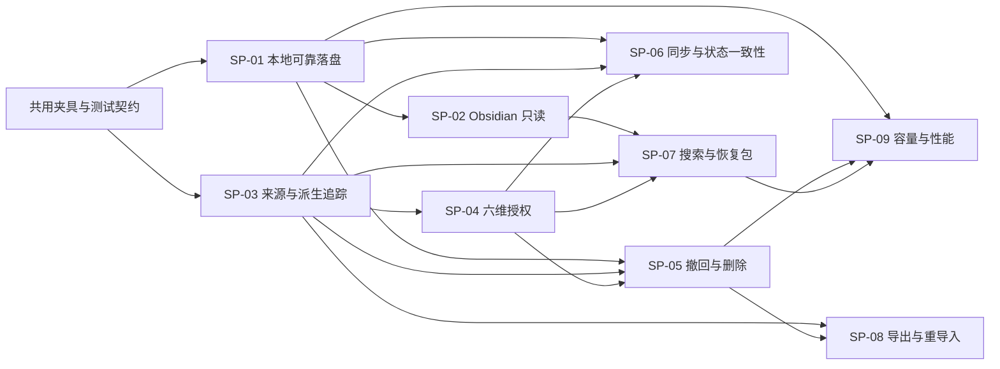

# LIFEOS-P0-005｜技术可行性 Spike 计划

- 文档版本：V0.1 Draft
- 更新日期：2026-08-08
- 项目阶段：Stage 0（项目启动与底层定义）
- 文档状态：专项任务交付，待 PM 主会话验收；不构成技术架构、技术栈、数据库表或 V1 范围冻结
- 主责角色：技术架构负责人
- 协审角色：数据 / 领域模型负责人、AI 信任与安全负责人、PM / 项目总负责人

## 0. 结论标记与任务边界

- **[项目事实]**：来自已接受的项目文件、决策日志或风险日志。
- **[外部事实]**：来自检索日期为 2026-08-08 的官方一手资料。
- **[推断]**：基于项目事实或官方资料形成、尚未经过 LifeOS 实测的判断。
- **[建议]**：本计划推荐 PM 采用的验证方式或顺序。
- **[风险]**：若未验证或验证失败，可能阻塞 V1 或损害用户信任。
- **[需 PM 确认]**：影响 V1 范围、架构冻结、质量预算或阶段推进，专项会话无权冻结。

本任务只定义技术风险、最小验证路径、验收标准和失败分支，不写业务代码、不搭完整工程、不选择云供应商、不冻结技术栈、不设计最终数据库表/API，也不把 Spike 粗估当成开发排期。

## 1. 执行摘要

1. **[建议] V1 进入正式开发前必须完成 9 个阻断型 Spike。** 它们覆盖本地可靠落盘、Obsidian 只读接入、来源/版本/派生追踪、六维授权、撤回与删除传播、离线同步状态一致性、可信混合搜索与项目恢复、可迁移导出、100 万内容单元/300 万分块容量验证。
2. **[推断] 最大技术风险不是“能否生成摘要”，而是撤回或删除后能否立即停止活跃使用，并能发现、清理和验证向量、全文索引、缓存、队列、备份、离线设备和第三方副本。** 该链路失败会直接触发 R-0013，属于 V1 信任阻断项。
3. **[建议] 采用“安全边界强一致、物理清理可追踪”的双层验收。** 撤回/删除提交成功后，正常读取、搜索、建议、队列取任务和新模型调用必须立即排除受影响数据；物理副本允许异步清理，但必须有状态、重试、死信、验证与诚实披露。
4. **[建议] 当前 `Tauri 2 + React + SQLite/FTS5 + Fastify 模块化单体 + PostgreSQL/pgvector` 仍是合理的 Spike 基线，但没有任何部分因此冻结。** 最大待验证点是桌面文件权限与只读保证、SQLite 耐久性/索引删除、同步冲突、pgvector 在权限/Project 过滤下的召回与资源成本。
5. **[建议] 领域语义应以最小实现映射验证，不能把 11 个对象 + `Link` 机械实现为 11 张表或 11 个 UI 模块。** Spike 只需证明 `Source/Artifact/version/Derivation/Authorization/Feedback/AuditEntry/Link` 的不变量可表达、可查询、可失效、可导出。
6. **[建议] Spike 分三条并行轨道：本地与来源、信任与状态、搜索与规模。** 依赖骨架与测试夹具先行；撤回传播必须建立在来源/派生追踪和授权判定之上；容量测试使用同一查询与删除语料，避免“功能通过、规模失败”被割裂。
7. **[需 PM 确认] Stage 1 可以在本计划通过 PM 验收后启动范围/PRD 定义，但不能把候选栈写成冻结结论；Stage 3 前必须完成全部阻断型 Spike、关键冻结项独立评审，并对失败项做范围调整或记录不可绕过底线之外的正式例外。**

## 2. 已验证事实与外部技术依据

### 2.1 项目事实

1. LifeOS 的 V1 第一场景是“开工/切换项目时的 5 分钟上下文恢复与下一步确认”，价值排序为“找回上下文 > 下一步/减少遗漏 > 今日重点”。
2. V1 要求离线捕获、本地可靠落盘、云/模型处理透明可控；用户原文不得被 AI 静默改写。
3. V1 AI 能力上限为“可读、可整理、可建议，不可替用户确认”；AI 候选 Action/Decision/Link 不得自动成为用户确认状态。
4. `Authorization` 采用主体、范围、动作、目的、位置、时效六维模型；连接 Obsidian 不等于允许云同步或第三方模型处理。
5. 撤回后采用“活跃使用立即阻断、物理清理状态追踪”；历史审计只保留不可还原内容的最小元数据。
6. Obsidian Vault 是 V1 优先本地文件型来源，采用只读接入、来源追踪、AI 派生不写回原文；V1 不默认做插件或双向同步。
7. 容量假设为长期 100 万内容单元、约 300 万分块、3-5 台设备、每天 100-500 次搜索与 50-200 次 AI 调用，尚未基准测试。
8. 核心领域模型和 AI 权限模型已被 PM 接受为工作模型，但尚未正式冻结，冻结前需要独立评审。

### 2.2 官方资料校准

以下资料只证明候选技术存在相关能力或限制，不证明 LifeOS 已可行：

1. **[外部事实] SQLite WAL 允许读者与写者并行，但仍只有串行写入路径；自动 checkpoint 可能带来偶发长提交，长读事务还可能造成 checkpoint 饥饿和 WAL 持续增长。** 因而本地 Spike 必须测写入延迟分布、checkpoint、崩溃恢复和长读压力，不能只测平均 TPS。来源：[SQLite WAL](https://www.sqlite.org/wal.html)。
2. **[外部事实] SQLite 官方提供 Online Backup API 与 `VACUUM INTO` 等一致性备份方式；直接复制活跃数据库且遗漏 `-wal`/journal 可能产生损坏副本。** 因而备份必须走数据库感知路径。来源：[SQLite Backup API](https://www.sqlite.org/backup.html)、[How To Corrupt An SQLite Database File](https://www.sqlite.org/howtocorrupt.html)。
3. **[外部事实] FTS5 的 external-content 模式要求应用保证正文与索引一致；删除顺序错误可能留下 token。普通删除还可能在文件中保留可恢复痕迹，FTS5 `secure-delete` 与 SQLite `secure_delete`/`VACUUM` 有不同作用。** 因而“查询不命中”和“物理不可恢复”必须分别验证。来源：[SQLite FTS5](https://www.sqlite.org/fts5.html)、[SQLite PRAGMA](https://www.sqlite.org/pragma.html)。
4. **[外部事实] Tauri 2 的 capability 能限制窗口/WebView 对命令与插件的访问，但多个 capability 会合并权限，且自定义命令仍需正确实现 scope 检查。** 因而 Tauri capability 只是防线之一，不能代替 LifeOS 的六维授权与 Vault 只读不变量。来源：[Tauri Capabilities](https://v2.tauri.app/security/capabilities/)、[Tauri File System](https://v2.tauri.app/plugin/file-system/)。
5. **[外部事实] Obsidian Vault 本质上是包含笔记、附件和配置目录的本地文件夹；官方支持 Markdown、YAML properties、Wikilink/Markdown link、块/标题链接和多类附件。** 因而 Spike 必须以文件系统事件和文本语法为准，而不能依赖 Obsidian 内部数据库。来源：[Obsidian Vault](https://github.com/obsidianmd/obsidian-help/blob/master/en/Files%20and%20folders/Manage%20vaults.md)、[Properties](https://obsidian.md/help/properties)、[Internal links](https://obsidian.md/help/links)、[Accepted file formats](https://obsidian.md/help/file-formats)。
6. **[外部事实] PostgreSQL 内置全文搜索可使用 GIN；pgvector 支持精确检索、HNSW 与 IVFFlat，近似索引用速度换召回，且元数据过滤通常在 ANN 扫描后生效，可通过 iterative scan、部分索引或分区缓解。** 因而必须在真实 Project/Authorization 过滤选择性下测召回，不能只跑无过滤向量榜单。来源：[PostgreSQL Full Text Search](https://www.postgresql.org/docs/current/textsearch.html)、[PostgreSQL GIN](https://www.postgresql.org/docs/current/gin.html)、[pgvector](https://github.com/pgvector/pgvector)。
7. **[外部事实] pgvector 文档给出的 `vector` 原始存储约为 `4 × dimensions + 8` 字节/向量，不含表、索引和 MVCC 开销。** 以 300 万个 1536 维向量推算，仅向量值约 17.2 GiB；维度、半精度、分块策略和索引类型会显著改变总体成本，因此均不得提前冻结。来源同上；容量数字为本报告推算。
8. **[外部事实] PostgreSQL `SKIP LOCKED` 可降低多消费者队列表的锁竞争，但会给出不一致视图，只适合 queue-like table，不是一般状态一致性方案。** 因而 Postgres job queue 可做候选，但需要幂等、租约、重试和撤回竞态 Spike。来源：[PostgreSQL SELECT locking clause](https://www.postgresql.org/docs/current/sql-select.html)。

检索日期：2026-08-08。未使用博客或二手基准作为项目事实。

## 3. 技术风险地图

| 风险 ID | 风险 | 项目风险映射 | 发生可能性 | 影响 | 是否阻塞 V1 | 首要验证 |
|---|---|---|---|---|---|---|
| TR-01 | 应用显示“已保存”但崩溃/断电后记录丢失或损坏 | R-0005 | 中 | P0 | 是 | SP-01 |
| TR-02 | Vault 文件移动、重命名、删除或同名导致错误合并/重复 | R-0008、R-0012 | 高 | P0 | 是 | SP-02 |
| TR-03 | AI 输出无法回溯精确输入版本、授权和处理位置 | R-0002、R-0008 | 中 | P0 | 是 | SP-03 |
| TR-04 | 六维授权只存在设置页，实际任务/队列/模型调用绕过 | R-0014 | 高 | P0 | 是 | SP-04 |
| TR-05 | 撤回/删除遗漏派生物、向量、索引、缓存、队列、备份或第三方副本 | R-0013 | 高 | P0 | 是 | SP-05 |
| TR-06 | 离线多设备/重试使候选 Action、用户 Feedback 与当前状态不一致 | R-0017 | 中 | P0 | 是 | SP-06 |
| TR-07 | 混合搜索能返回文本，却不能返回可信恢复包与证据链 | R-0010 | 中 | P0 | 是 | SP-07 |
| TR-08 | 导出遗漏原文身份、版本、来源、确认状态或重要关系，无法迁移/复核 | R-0005、R-0008 | 中 | P0 | 是 | SP-08 |
| TR-09 | 100 万内容/300 万分块下索引、过滤、删除、备份成本失控 | R-0004、R-0008 | 高 | P0 | 是 | SP-09 |
| TR-10 | 桌面壳或插件权限过宽，Vault 只读保证被前端/IPC 绕过 | R-0013、R-0014 | 中 | P0 | 是 | SP-02、SP-04 |
| TR-11 | 第三方服务无法按 LifeOS 语义删除输入/输出或披露保留期 | R-0013 | 高 | P0 | 对第三方模型能力是 | SP-04、SP-05 |
| TR-12 | 为解决上述问题过早引入微服务、Kafka、图数据库或重型 Agent 框架 | R-0004、R-0012 | 中 | P0 | 是 | 全部 Spike 的复杂度护栏 |

## 4. Spike 共用验证契约

### 4.1 必须贯穿所有 Spike 的不变量

1. 已确认落盘的用户原文版本不被 AI 或同步原地覆盖。
2. 每个 AI/算法输出能回溯 `Derivation → 精确输入版本 → Source/Artifact → Authorization → 处理位置/主体 → 工作流/模型版本`。
3. AI 候选 Action/Decision/Link 未经对象级 Feedback 不能进入用户确认状态。
4. 授权判定默认拒绝；Project 关系不能放宽 Source/Artifact 的更严格权限。
5. 撤回/删除提交成功后，受影响数据立即退出活跃读取、搜索、建议、排队任务和模型上下文。
6. 物理清理失败必须可见、可重试、可审计，不能把“已阻断”误报为“所有副本已删除”。
7. 备份恢复与离线设备重连必须重新应用撤回/删除墓碑，不能复活被禁用数据。
8. 原文、外部来源、AI 整理、AI 推断/建议、用户确认事实在查询、恢复包与导出中保持身份区分。
9. 重要 Link 有建立者/来源、确认状态和有效性；不要求所有展示关系重型化。
10. 最小 AuditEntry 不保存可还原原文、完整提示、摘要正文或向量。

### 4.2 共用测试夹具

**[建议]** 先建立一套非生产、无真实敏感数据的确定性夹具，供所有 Spike 复用：

- 3 个个人 Project，包含跨项目材料和一条无 Project 材料；
- 1 个模拟 Vault：同名文件、重命名/移动、修改、删除、断开、符号链接、排除目录、YAML、标签、Wikilink、Markdown link、块引用、附件和破损链接；
- 用户原文、外部原文、网页指针、确认 Decision、候选/确认 Action、冲突 Assertion、重要/普通 Link；
- 3 组 Authorization：仅本地搜索、允许 LifeOS 云处理、允许指定第三方模型；含期限、撤回与排除规则；
- 2 个可替换的假模型适配器：本地 deterministic stub 与远端 mock，记录实际发送字段，不调用付费资源；
- 可控故障：进程 kill、磁盘满、写入失败、重复消息、乱序同步、网络分区、队列租约过期、备份恢复、第三方删除失败；
- 规模数据生成器：1 万/10 万/100 万内容单元与最多 300 万分块，向量使用确定性合成数据，避免模型调用费用。

### 4.3 统一结果包

每个 Spike 必须输出：

- 代码/原型（后续专项任务内部产物，不是本计划交付）；
- 可重复运行说明与固定数据集版本；
- 环境、依赖版本和配置；
- 功能正确性、延迟、吞吐、资源、错误注入结果；
- 失败样例和原始日志；
- 通过/部分通过/失败结论；
- 对 V1 范围、PRD、架构候选和风险日志的影响；
- 删除 Spike 产生数据的清理说明。

## 5. Spike 总览与优先级

| Spike | 名称 | 阻断级别 | 推荐阶段 | 依赖 | 粗估（人日） | 直接影响 |
|---|---|---:|---|---|---:|---|
| SP-01 | 本地可靠落盘、离线捕获、备份恢复 | P0 | Stage 2 首批 | 共用夹具 | 3-4 | 本地数据路线、捕获 PRD |
| SP-02 | Obsidian Vault 只读接入与来源身份 | P0 | Stage 2 首批 | SP-01 最小存储 | 4-5 | Obsidian V1 深度、桌面权限 |
| SP-03 | 来源/版本/Derivation/证据链最小映射 | P0 | Stage 2 首批 | 共用夹具 | 3-4 | 领域模型最小实现、今日页证据 |
| SP-04 | 六维授权判定与本地/云/第三方边界 | P0 | Stage 2 首批 | SP-03 | 3-4 | AI 能力开关、模型网关契约 |
| SP-05 | 撤回/删除传播、依赖发现与清理验证 | P0 | Stage 2 第二批 | SP-01、03、04 | 5-7 | AI 权限冻结、删除 PRD、备份策略 |
| SP-06 | 离线同步与 Action/Decision/Link/Feedback 状态一致性 | P0 | Stage 2 第二批 | SP-01、03、04 | 4-6 | 云同步范围、L3 候选范围 |
| SP-07 | 混合搜索、Project 恢复包与可信建议证据 | P0 | Stage 2 第二批 | SP-02、03、04 | 5-7 | 首页/今日页 PRD、搜索架构 |
| SP-08 | 可迁移导出、恢复与重导入 | P0 | Stage 2 第二批 | SP-03、05 | 3-4 | 数据主权、导出格式 |
| SP-09 | 100 万内容/300 万分块容量与性能 | P0 | Stage 2 持续/收口 | SP-01、05、07 查询集 | 5-7 | 分块/向量/索引/部署候选 |

合计为约 **35-48 人日的验证工作量**。这是发现成本范围，不是实现排期；三条轨道并行时，建议以 3-4 个验证波次收口，而不是一次建设完整工程。

## 6. 各 Spike 详细计划

### SP-01｜本地可靠落盘、离线捕获、备份恢复

**验证目标**

- 证明桌面端在无网络时可以可靠捕获原文并只在耐久提交后显示“已保存”。
- 验证进程崩溃、系统强杀、磁盘满、checkpoint、长读与备份/恢复下的数据完整性。

**核心假设**

- [推断] 单用户桌面工作负载可由 SQLite 事务 + WAL 支撑，无需本地服务或分布式日志。
- [推断] 一致性备份 API、删除墓碑与启动时恢复检查可以覆盖 V1 最低恢复需求。

**方法与输入**

1. 建立最小捕获原型：原文版本、设备写入 ID、幂等键、提交回执；不实现完整 UI。
2. 比较 SQLite `WAL + synchronous=FULL` 与经证据允许的备选配置；记录 p50/p95/p99 和偶发 checkpoint 长尾。
3. 在“写前、写中、commit 后、UI 回执后”四个时点循环强杀；模拟磁盘满、I/O 错误、重复提交和时钟偏移。
4. 测长读事务与后台索引并发，观察 WAL 增长和 checkpoint 饥饿。
5. 使用 Online Backup API 或 `VACUUM INTO` 形成快照；恢复后运行 `integrity_check`、对象计数、内容 hash 与墓碑重放。
6. 明确本地数据库不得放在不可靠网络文件系统上；测试数据库、WAL、附件/对象文件的一致恢复边界。

**产物**

- 耐久写入测试报告、故障矩阵、恢复 runbook、备份一致性报告、配置对比和失败日志。

**通过标准**

- 任何已返回“已保存”的记录在故障恢复后均存在且 hash 一致；未确认提交可丢弃但不得形成半条原文。
- 1,000 次随机强杀循环中 `integrity_check` 全部通过，且无已确认记录丢失、重复或原文覆盖。
- 磁盘满/I/O 错误不会误报已保存；恢复后可继续捕获或给出可行动错误。
- 标准 16GB 开发机上，单条文本捕获 p95 ≤ 150ms、p99 ≤ 500ms（暂定工程预算，需 PM 确认测试硬件）；后台读取/索引不得冻结输入主路径。
- 在线备份可恢复到一致快照，恢复后删除墓碑仍生效；备份时不直接裸拷贝活跃数据库。

**失败处理**

- 若同步级别导致体验不可接受，先优化事务批次和后台工作，不以 `synchronous=OFF` 换性能。
- 若多进程写入/长读使 WAL 不可控，收敛为单写入者和短事务；不因此引入本地微服务。
- 若附件与数据库无法一致恢复，V1 需定义附件状态机/内容寻址或缩小离线文件范围，需 PM 确认。

### SP-02｜Obsidian Vault 只读接入与来源身份

**验证目标**

- 证明可在不写回 Vault 的前提下读取目标范围、解析关键语法、追踪来源、处理移动/修改/删除/断开，并执行目录排除。

**核心假设**

- [推断] “文件系统观察 + 内容/元数据指纹 + 不确定时保留候选”足以支撑 V1，不需要 Obsidian 插件或私有内部数据库。

**方法与输入**

1. 用模拟 Vault 覆盖 Markdown、YAML、标签、Wikilink/Markdown link、标题/块引用、附件、破损链接、同名文件、配置目录和隐藏文件。
2. 对首次扫描、增量变化、应用未运行期间的变化进行对账；文件 watcher 丢事件时用可恢复全量 reconciliation 补齐。
3. 构造重命名、同目录移动、跨目录移动、复制后删除、同内容不同文件、同时修改和删除；比较路径、文件系统 ID（若可用）、内容 hash、尺寸/时间等身份策略。
4. 在 OS 权限与 Tauri capability 层尽可能只授予读；另以集成测试拦截所有写、改名、删除、sidecar 创建和 metadata 写回调用。
5. 撤回某目录授权时验证后续扫描、全文索引、恢复包和模型输入都不再包含该目录。

**产物**

- Vault 兼容矩阵、身份判定策略、事件对账报告、只读不变量测试、排除规则报告和来源指针样例。

**通过标准**

- 所有测试过程中 Vault 树与文件 hash 前后完全一致，LifeOS 不产生 sidecar、不修改 `.obsidian`、frontmatter、链接或附件。
- 首次扫描后，增量修改/删除/新增在稳定窗口内 100% 对账；丢 watcher 事件后全量 reconciliation 能修复状态。
- 明确重命名样例 ≥ 95% 自动识别；歧义样例必须进入候选/新对象，不得错误强合并。该阈值是工程目标，不是产品准确率承诺。
- 相对 Vault/文件/标题或块的来源指针可返回原位置；来源不可达时明确显示缺口。
- 排除目录和撤回目录在下一次授权判定后不再读取、索引或发送；不存在路径遍历/符号链接越界。

**失败处理**

- 若跨平台稳定身份不足，V1 将路径 + 内容版本作为来源证据，移动匹配保持候选并提供用户纠正，不承诺自动无损合并。
- 若 OS/Tauri 无法从能力层保证只读，以“后端唯一文件访问边界 + 无写命令暴露 + 审计测试”补强；仍失败则需换桌面文件访问实现，需 PM 确认。
- 若附件解析明显扩大范围，V1 可只保留附件路径/元数据，不做内容提取；属于范围调整，需 PM 确认。

### SP-03｜来源、版本、Derivation 与证据链最小映射

**验证目标**

- 用最小实现证明 Source/Artifact 分离、不可覆盖版本、重要 Link、Derivation、Feedback、Authorization 与 AuditEntry 能支撑追溯、失效和导出，不把领域模型等同于物理表。

**核心假设**

- [推断] 模块化单体内的关系型数据 + 显式依赖边即可满足 V1，无需专用图数据库或全量事件溯源。

**方法与输入**

1. 针对两条端到端链建立概念验证：Obsidian 原文 → 候选下一步 → Feedback；外部材料 → Decision 证据 → 输入更新后失效。
2. 为每个 Derivation 记录精确输入版本、目的、主动性、授权引用/快照摘要、处理位置/主体、工作流/模型配置版本、输出身份、有效状态和替代关系。
3. 生成一条恢复建议并从输出反查 1-3 个关键证据及完整依赖；再修改一个输入版本，验证只影响依赖闭包而非全库重建。
4. 比较聚合存储、少量关系表和 JSON 包络等最小映射；评估查询/迁移/约束成本，不产出最终 schema。

**产物**

- 概念映射、两条完整证据链、依赖查询与失效报告、最小字段建议、被拒绝的过重方案说明。

**通过标准**

- 任一关键 AI 输出可在一次调试查询中定位全部精确输入版本、来源、授权、处理位置、生成版本和用户 Feedback。
- 输入版本变化后，受影响派生物集合无漏报；误报范围可解释且不会触发全库失效。
- 用户确认不会抹掉 AI 来源身份；原文与派生正文不共享可被静默覆盖的权威字段。
- 重要 Link 能记录建立者/来源、确认与有效状态；普通展示关系允许轻量化。
- 实现不要求图数据库、事件总线、11 张固定表或企业审计平台。

**失败处理**

- 若依赖闭包查询复杂，先引入显式 `derivation_input`/依赖索引语义，不引入通用知识图谱。
- 若授权快照与当前授权难以区分，保留“当时判定证据 + 当前有效性”双视角，不复制敏感正文。
- 若最小映射仍过重，记录具体缺失语义交核心领域模型独立评审，不能静默删掉 Source/Derivation/Feedback/Authorization。

### SP-04｜六维授权判定与本地/云/第三方处理边界

**验证目标**

- 证明六维 Authorization 能在每次读取、索引、队列执行、云同步和模型调用前被执行，而不是仅用于展示。

**核心假设**

- [推断] 集中式 policy evaluator + 各处理边界强制调用 + 授权版本/租约可在模块化单体内实现，无需企业 IAM/策略平台。

**方法与输入**

1. 将主体、范围、动作、目的、位置、时效编码为与数据库无关的决策契约，覆盖 allow/deny/indeterminate 与理由。
2. 生成组合测试与 property-based 测试：多输入取最严格交集、排除优先、过期、撤回、范围扩大、供应商变化、长任务中途撤回。
3. 让本地 stub、LifeOS 云 mock、第三方模型 mock 使用同一网关；记录实际发送字段、接收主体、授权版本和最小化结果。
4. 对 Vault 路径、Project 关系、跨项目建议、索引、摘要、训练/评估用途分别测试，验证一种用途授权不能横向复用。
5. 在入队和执行前双重判定；执行中分段长任务在关键阶段重检，撤回后取消/隔离输出。
6. 评估凭据/私钥检测作为额外拒绝层的误报漏报，但不把它当授权替代。

**产物**

- 授权决策表、决策契约、组合测试结果、模型网关发送清单、长任务撤回竞态报告、第三方能力矩阵模板。

**通过标准**

- 全部允许路径均能指向一条当时有效且六维匹配的授权；无匹配/冲突/不确定时默认拒绝并给出原因。
- Project 归属不能放宽 Source 排除或仅本地限制；搜索授权不能用于摘要/下一步/训练。
- 远端 mock 收到的字段与明确授权范围完全一致；路径/无关元数据/排除内容不外发。
- 长任务撤回后，未完成阶段停止；撤回后完成的竞态结果不可发布、不可索引、不可进入恢复包。
- 供应商、位置、目的或范围扩大均需新授权，不能沿用旧授权版本。

**失败处理**

- 若六维运行时成本过高，优化编译/缓存授权决策，但缓存键必须包含授权版本与时效；不得降级为 AI 总开关。
- 若第三方无法提供所需保留/删除信息，对该供应商禁用对应敏感能力或只发送不可逆最小数据；是否纳入 V1 需 PM 确认。
- 若授权表达对 PRD 过重，交体验设计打包低风险同目的授权；技术语义不因 UI 简化而丢失。

### SP-05｜撤回/删除传播、依赖发现与清理验证

**验证目标**

- 证明撤回/删除能覆盖原文副本、Derivation 输出、候选业务对象、全文索引、向量、缓存、任务队列、备份、离线设备和第三方 mock，并可验证“不再活跃使用”。

**核心假设**

- [推断] “授权/对象版本门控 + 显式依赖清单 + tombstone/outbox + 幂等清理状态机”可满足 V1，无需分布式事件平台。

**方法与输入**

1. 建立依赖类型登记：权威原文、版本、分块、FTS posting、向量、摘要、候选 Link/Action/Decision、缓存、prompt 副本、队列 payload、对象文件、备份、离线副本、第三方调用。
2. 为撤回、删除 Artifact、删除/断开 Source、目录排除、输入更新、用户纠正分别生成影响集合。
3. 实现两阶段语义：A）事务内使授权/对象版本不可活跃消费并写入清理 outbox；B）异步物理清理/重建，带租约、重试、死信和验证。
4. 在每个清理步骤前后 kill 进程、重复消息、乱序执行、网络失败；验证幂等和最终状态。
5. 对 FTS 执行命中测试与索引一致性检查；对向量执行 ID/邻近查询；对缓存/队列检查 payload；对备份恢复后重放墓碑；对第三方 mock 模拟已删/待删/不支持删除。
6. 区分三类状态：`active_blocked`、`physical_cleanup_pending/failed`、`physically_cleaned_or_vendor_limited`，并验证用户可理解的诚实说明。

**产物**

- 依赖清单、传播状态机、故障注入报告、遗漏扫描报告、备份恢复报告、第三方限制矩阵和清理证明样例。

**通过标准**

- 撤回/删除事务提交后，所有活跃读取、FTS/向量查询、恢复包、今日建议、队列取任务和新模型调用立即无法使用受影响数据；测试集漏阻断为 0。
- 清理任务在重复、乱序和故障恢复后收敛；死信可见且不解除活跃阻断。
- FTS、向量、缓存和队列验证均不再命中/携带目标内容；可还原摘要/提示副本被删除或不可逆处理。
- 从任一测试备份恢复后，在开放正常查询前重放墓碑，目标数据不得复活。
- 第三方无法即时/完全删除时，状态明确为供应商受限，且不会误报“完全删除”。
- 最小审计只保留对象不可还原标识、动作类别、时间、范围和结果；抽样验证不能重建内容。

**失败处理**

- 任何活跃路径漏阻断：P0 失败，禁止进入 Stage 3，不能以“以后清理”例外绕过。
- 物理清理有可追踪延迟但活跃阻断可靠：可 Partial，通过 PM 决定清理窗口和用户披露；备份/第三方窗口必须进入 PRD。
- 若通用依赖图过重，限定为派生类型注册表和反向依赖索引；不得用专用图数据库掩盖缺乏删除语义。

### SP-06｜离线同步与 Action/Decision/Link/Feedback 状态一致性

**验证目标**

- 证明 3-5 台设备离线编辑、重复上传、乱序、并发 Feedback、撤回和删除下，原文版本与用户权威状态不被 AI 候选覆盖。

**核心假设**

- [推断] 客户端操作 ID、不可变版本、幂等服务端、对象级状态规则、tombstone 与明确冲突可满足 V1；无需全量 CRDT 或事件溯源。

**方法与输入**

1. 针对原文新增/编辑、AI 候选生成、用户接受/编辑后接受/拒绝/撤回、Action 完成/延期、Decision 修订、Link 确认/纠正建立状态转换表。
2. 构造离线 A/B 设备：同一候选一端接受一端拒绝、用户编辑与 AI 重建并发、已删除对象离线重现、授权撤回时仍有离线队列。
3. 重放重复、乱序和延迟消息，验证幂等、因果/版本前置条件、冲突显式化与 tombstone 优先级。
4. 比较“服务端权威 + append-only Feedback/操作日志”“字段级 LWW”“有限 CRDT”在 V1 对象上的复杂度；不默认引入通用 CRDT。
5. 用 Postgres queue-like table 候选验证租约、`SKIP LOCKED`、重试与撤回前置检查；队列不是权威状态来源。

**产物**

- 状态转换/冲突矩阵、同步协议最小契约、重放测试结果、队列故障报告、需要用户解决的冲突清单。

**通过标准**

- 同一客户端操作重复 100 次只产生一个业务效果，审计可解释重试。
- 乱序/并发测试全部收敛到确定或显式冲突状态；不存在 AI 候选自动覆盖用户确认/拒绝/纠正的路径。
- 删除/撤回 tombstone 优先阻断活跃使用，离线旧版本重连不得复活对象或重新入模。
- Feedback 历史保留，当前状态可由 Feedback/版本解释；撤回 Feedback 以新记录表达。
- 队列任务执行前重新校验对象版本与授权；过期任务不产生可见输出。

**失败处理**

- 若通用自动合并不可靠，V1 对冲突原文保留双版本并请求用户处理，对权威 Action/Decision 采用对象级前置版本检查。
- 若多设备同步使 Stage 2 范围失控，可将 V1 云同步缩小为先支持单账号少设备/非实时，但修改 V1 候选范围需 PM 确认；离线捕获不可移除。
- 若 L3 候选物化导致状态复杂度显著上升，可将其降为 L1 Derivation 展示，不进入持久业务集合；需 PM 确认。

### SP-07｜混合搜索、Project 恢复包与可信建议证据

**验证目标**

- 证明系统能在当前授权下混合关键词、向量、元数据和确认语义，返回可核对的 Project 恢复包与 1-3 个候选下一步，而不是只生成流畅文本。

**核心假设**

- [推断] SQLite FTS5（本地）与 PostgreSQL FTS + pgvector（云端候选）配合元数据过滤/重排可满足 V1；不需要独立搜索集群或向量数据库。

**方法与输入**

1. 建立 50-100 条人工标注查询集：精确找回、同义找回、最近变化、已确认 Decision、未完成 Action、冲突证据、来源不可达、权限排除和跨项目干扰。
2. 分别测试关键词、向量、混合召回 + 元数据/权限过滤 + 重排；记录 nDCG/Recall@k、首条有效结果、延迟与空结果原因。
3. 对 pgvector 比较 exact、HNSW、IVFFlat；在不同 Project/Authorization 过滤选择性下测试 iterative scan、部分索引或分区，不预设最终索引。
4. 组装最低恢复包：上次停点/近期 Event、确认 Decision、开放 Action、未处理材料、关键冲突/Assertion、来源与时间缺口。
5. 让 deterministic AI stub 生成 1-3 个候选下一步；验证每条返回理由、证据 ID/版本、身份、时效、冲突、权限缺口和反馈入口。
6. 删除/撤回一条证据，验证搜索和恢复包立即排除派生物；已确认对象显示“证据不可用/待复核”，不静默删除历史决定。

**产物**

- 标注语料、检索基线、过滤/召回对比、恢复包 JSON 样例、证据链完整性报告、失败查询集。

**通过标准**

- 所有返回项均在当前 Authorization 内，权限泄漏为 0；候选 Project 归属不会伪装成用户确认过滤条件。
- 标注查询 Recall@20 ≥ 0.90；关键“确认 Decision/开放 Action/精确原文”查询 Recall@10 = 1.00。阈值为 Spike 工程门槛，后续需用户研究校准。
- 10 万内容单元基线下本地关键词检索 p95 ≤ 300ms；混合召回/重排 p95 ≤ 2s；完整恢复包（不含外部模型网络时间）p95 ≤ 3s。
- 每条重点/下一步返回 1-3 个可打开的关键证据，且精确版本、来源身份、生成时间、确认状态和缺口齐全；证据完整性测试 100% 通过。
- 来源不可达、证据冲突或授权受限时，结果明确降级，不生成看似完整的恢复叙述。

**失败处理**

- 若向量增益不足，V1 可先采用 FTS + 元数据 +轻量重排，向量不作为上线硬依赖；需 PM 在 PRD 中确认。
- 若过滤后 ANN 召回不可接受，先尝试 exact/混合候选、iterative scan、部分索引或分区；不直接引入独立向量库。
- 若证据链严重拖慢，先预计算可失效的恢复包构件并保留版本门控，不删除证据要求。

### SP-08｜可迁移导出、恢复与重导入

**验证目标**

- 证明用户能导出原文、来源、版本、确认状态、派生物、Feedback、重要关系与最小审计说明，并能在无 LifeOS 专有服务时理解和校验。

**核心假设**

- [推断] “人可读目录 + 稳定机器可读 manifest + 内容文件 + 校验和”可满足 V1，且不要求导出内部索引/向量。

**方法与输入**

1. 定义非冻结导出概念格式：原文文件保持可读；JSON/JSONL manifest 记录 Source/Artifact/version、身份、时间、确认状态、Derivation、Feedback、重要 Link 和授权/删除说明。
2. 对只保留来源指针、已缓存外部快照、来源不可达、派生已失效、证据已删除、候选/确认对象分别导出。
3. 导出前执行授权/许可检查，区分“用户数据主权”和“外部内容再分发许可”。
4. 在空环境验证 schema、checksum、引用闭包、缺失文件说明；实现最小重导入/恢复验证，不承诺跨版本完整产品还原。
5. 确认向量、FTS posting、缓存和重排特征不必导出，但可以从合法原始数据重建。

**产物**

- 示例导出包、格式说明、校验器报告、往返测试、缺失/权限说明和重建清单。

**通过标准**

- 测试集中 100% 用户原文版本、来源指针、内容身份、确认状态、Feedback 和重要 Link 在 manifest 可定位；checksum 与引用闭包通过。
- AI 派生明确标记输入引用、生成身份、状态和模型/工作流版本；不会伪装成用户原文。
- 已删除正文、不可导出的外部内容和失效证据不被复活，只保留不可还原说明。
- 使用通用文本/JSON 工具可读取；不依赖 LifeOS 云、特定模型或专用数据库。
- 重导入不会覆盖已有原文，重复导入幂等或形成显式冲突。

**失败处理**

- 若完整派生链体积过大，允许把可重建基础设施派生排除，但必须保留业务重要派生的身份/证据与排除说明。
- 若外部内容许可不清，只导出指针、用户摘录和许可内快照；规则需进入 PRD/法律后续任务。

### SP-09｜100 万内容单元、300 万分块容量与性能

**验证目标**

- 在重度个人使用基线下测存储、索引构建/更新、搜索、失效、删除、备份、恢复和资源成本，识别需缩小的 V1 假设或不可冻结的技术选择。

**核心假设**

- [推断] 单机 SQLite（本地）与单 PostgreSQL 实例（云端）在合理索引/分块策略下可覆盖早期个人工作负载，不需要分片、Kafka、Kubernetes、独立向量数据库或搜索集群。

**方法与输入**

1. 生成 1 万/10 万/100 万内容单元与 3 倍分块；保持 Project、时间、来源、授权、版本、Link 和删除分布，避免纯随机无过滤数据。
2. 向量维度至少测试 384/768/1536，比较 `vector`/候选半精度、exact/HNSW/IVFFlat；记录原始向量、索引、WAL、表、备份总大小与构建峰值内存。
3. 对本地 SQLite 测捕获、FTS 初建/增量、checkpoint、删除/secure-delete、备份/恢复和 integrity check。
4. 对 PostgreSQL 测 FTS GIN、pgvector 过滤召回、索引构建/更新、VACUUM、权限/Project 高低选择性、队列和删除传播。
5. 复用 SP-07 查询集和 SP-05 撤回/删除批次（单条、一个目录、一个 Source、1% 数据），测 p95/p99 与恢复时间。
6. 在目标最低环境测试：本地 16GB RAM；早期服务端 4 vCPU/16GB/200GB NVMe。若无法完整装载，记录真实原因并测试更小规模外推，但不能用外推代替最终结论。

**产物**

- 可重复基准、容量曲线、查询计划、召回/延迟/资源报告、删除与备份时间、成本模型和架构触发阈值。

**通过标准**

- 16GB 本地环境能在 100 万内容元数据/原文索引假设下启动、捕获和关键词搜索，无 OOM；后台维护不阻塞捕获超过 1 秒。
- 目标服务端可装载 100 万内容/300 万分块的至少一个候选配置，磁盘峰值不超过 200GB，且索引构建不要求常态内存超 16GB；若 1536 维 HNSW 不满足，不等于整体失败，应保留较低维/半精度/非 ANN 方案比较。
- 100 万规模下：关键词/元数据查询 p95 ≤ 500ms，混合检索 p95 ≤ 2.5s，恢复包数据组装 p95 ≤ 4s；并满足 SP-07 的召回/权限要求。
- 单条撤回的活跃阻断 p95 ≤ 1s；单 Source/1% 批量物理清理可持续推进、有 ETA/失败状态，且不影响前台查询与捕获可用性。
- 在线备份完成时间、恢复时间和所需额外空间均被实测并可接受；暂定目标为备份 ≤ 30 分钟、恢复并完成墓碑重放 ≤ 60 分钟，需 PM 结合产品承诺确认。
- 找到明确的垂直扩容/组件替换触发阈值，而非提前引入分布式架构。

**失败处理**

- 若 300 万向量成本/召回不合格，优先调整分块数量、维度、半精度、只为高价值内容生成向量、FTS-first；专用向量库仅在对比证据成立后评估。
- 若本地 100 万全文索引不现实，区分“本地权威原文/最近工作集”和“云端获准索引”，但任何云依赖都需 PM 确认且不得破坏离线捕获。
- 若删除/备份窗口不可接受，缩小 V1 保留/同步/附件范围或改变索引实现；不能取消活跃阻断与墓碑重放。

## 7. 依赖关系与推荐执行顺序

### 推荐波次

1. **波次 A：验证骨架**——共用夹具、SP-01、SP-03；同时准备规模生成器。
2. **波次 B：来源与权限**——SP-02、SP-04；开始 SP-09 的 1 万/10 万基线。
3. **波次 C：高风险闭环**——SP-05、SP-06、SP-07 并行；三者共享授权、依赖与故障测试。
4. **波次 D：可迁移与规模收口**——SP-08、SP-09 全量；生成架构候选对比与 Stage 3 go/no-go 输入。

并行不等于各自造数据模型：所有轨道必须复用对象 ID、版本、Authorization 决策契约、Derivation 包络和删除墓碑语义。

## 8. 技术架构候选项评估

| 候选 | 当前判断 | 可暂定内容 | 不得冻结/待验证内容 | 对应 Spike |
|---|---|---|---|---|
| Tauri 2 + React/TS/Vite | **可继续作为桌面 Spike 基线** | 桌面优先、Web UI + 原生文件/SQLite 桥接方向 | capability 合并、IPC scope、跨平台 watcher、只读保证、签名/升级不在本任务冻结 | SP-01、02、04 |
| SQLite + FTS5 | **合理且优先验证** | 本地权威捕获与关键词搜索候选；单写入者/事务优先 | WAL/synchronous/checkpoint、secure delete、100 万规模、附件一致性、最终 schema | SP-01、05、09 |
| Fastify 模块化单体 | **合理的服务端候选** | 单部署单体、模块边界、供应商中立接口 | 框架最终选择、运行时拓扑、同步 API、认证/部署细节 | SP-04、06 |
| PostgreSQL | **合理的云端候选** | 关系、版本、FTS、队列候选可共存，避免早期多存储 | 云端权威范围、同步冲突、分区、备份、最终 schema/版本 | SP-05、06、09 |
| pgvector | **保留候选，不是必选** | 与 Postgres 同库可降低早期运维面 | 维度/模型、HNSW/IVFFlat/exact、过滤召回、半精度、是否上线必需 | SP-07、09 |
| Postgres job queue | **可作为早期候选** | 简单异步任务、outbox/租约/幂等 | 重试、死信、优先级、长任务、何时才需 Redis/专用队列 | SP-05、06、09 |
| S3 兼容对象存储 | **概念候选** | 云端文件对象与数据库元数据分离方向 | 供应商、加密/删除、版本、离线附件同步和备份边界 | SP-05、08、09 |
| 自建模型网关 | **必要的抽象边界候选** | 统一授权检查、最小化、供应商/位置记录、结构化输出 | 供应商、路由、缓存、保留/删除能力、模型与维度 | SP-03、04、05 |

### 总体判断

**[建议]** 当前候选栈“大体合理”，因为它支持桌面本地能力、模块化单体和单一关系数据库优先，符合复杂度控制；但合理只表示值得用作 Spike 基线，不表示已证明能满足 LifeOS 的权限传播、删除、同步与规模要求。

## 9. 不应提前冻结的技术选择

1. SQLite 最终 schema、FTS5 content/external-content/contentless 模式、WAL 与同步参数。
2. 本地向量是否进入 V1、向量模型/维度、分块策略、量化和索引类型。
3. PostgreSQL/pgvector 的版本、HNSW/IVFFlat/exact、分区和物理部署。
4. 云端是否保存完整原文、只保存获准子集，或仅保存同步操作；这是产品/权限决策，不是纯技术默认。
5. 同步采用 LWW、操作日志、有限 CRDT 或对象级冲突的具体组合。
6. 对象/依赖的物理表结构；11 个领域对象不等于 11 张表。
7. 备份保留窗口、删除 SLA、第三方供应商删除承诺和法定审计保留期。
8. Fastify 是否最终采用、对象存储/云供应商、Redis/Temporal 的引入时点。
9. 专用图数据库、独立向量数据库、搜索集群、微服务、Kafka、Kubernetes、重型 Agent 框架。

### 允许触发更重组件评估的证据门槛

- 单体/单 PostgreSQL 在 SP-09 目标规模下经调优仍无法满足明确 SLO；
- 问题来自组件固有限制而非 schema、查询、索引或工作流错误；
- 替代组件在同一夹具和查询集上有可重复、显著收益；
- 增加的部署、删除传播、授权、备份和可观测成本已量化；
- PM 确认收益服务 V1 第一场景，而非为长期愿景或炫技提前建设。

## 10. 复杂度控制策略

1. **一个桌面应用 + 一个模块化服务端 + 一个主关系数据库优先。** 本地 SQLite 和云 PostgreSQL 是用途不同的两个存储边界，不继续按每种对象拆服务。
2. **同步调用 + Postgres queue/outbox 优先。** 只有实际吞吐/延迟证据才评估 Redis/专用队列；长流程确有恢复需求后再评估 Temporal。
3. **显式依赖边优先于通用图谱。** 只追踪派生、证据、重要关系和删除传播所需的边。
4. **FTS-first，向量增量证明价值。** 混合搜索的向量部分必须在标注集证明增益，不能因“AI 产品”默认必选。
5. **有限状态机优先于通用 Agent 编排。** Action/Decision/Feedback/Authorization 用明确状态和不变量，不用 Agent 自主决定权威状态。
6. **故障测试优先于演示 UI。** 每个 P0 Spike 必须包含 kill/retry/乱序/恢复/删除验证，否则不算通过。
7. **只保存需要长期成立的语义。** 可重建向量、分块、缓存和排序特征不进入用户业务对象或导出核心。

## 11. 对 V1 PRD 的影响

### 11.1 PRD 现在可以继承的技术约束

1. “已保存”只能在本地耐久提交后出现；离线捕获不依赖云。
2. Obsidian 明确只读；本地索引、AI 派生、云同步、第三方模型分层授权。
3. 每项 AI 能力必须声明输入范围、目的、位置、主体、输出身份和 Feedback。
4. 候选 Action/Decision/Link 与用户确认状态分开，支持确认、编辑、拒绝、忽略、纠正和撤回。
5. 撤回/删除 UI 区分“已停止使用”“正在清理”“清理失败/供应商限制”“已清理”。
6. 搜索与今日建议必须返回证据、版本、来源、时效、冲突和权限缺口。
7. 导出包含原文、来源、版本、确认状态、业务重要派生和关系；索引/向量可重建。

### 11.2 必须等待 Spike 结果再写死的内容

- Obsidian 移动/重命名自动识别承诺、附件内容提取深度、初次扫描时间；
- 本地/云各保存哪些内容、同步冲突体验与多设备上限；
- 向量搜索是否为 V1 必需、模型/维度和离线搜索能力；
- 删除/备份/第三方物理清理窗口；
- L3 候选物化是否进入 V1，还是保持 L1 派生展示；
- 性能 SLO 的最终数字和支持容量；
- 云端和第三方模型供应商。

### 11.3 会触发 V1 范围调整的 Spike 失败

| 失败 | 默认范围影响 | 决策性质 |
|---|---|---|
| SP-01 无法保证已确认记录不丢 | 不得进入正式开发；需改本地持久化方案 | 技术底线，不能降级绕过 |
| SP-02 无法可靠只读或执行排除 | Obsidian 接入退出 V1 或更换访问实现 | V1 范围变化，需 PM 确认 |
| SP-04 授权不能在实际边界强制执行 | 禁止相应云/第三方 AI 能力 | AI 权限/V1 范围，需 PM 确认 |
| SP-05 活跃阻断有遗漏 | 不得进入 Stage 3 | 信任底线，不能例外绕过 |
| SP-06 同步冲突无法守住用户权威 | 缩小多设备/同步/L3 范围 | V1 范围变化，需 PM 确认 |
| SP-07 向量无明显增益 | V1 采用 FTS/元数据优先，向量后置 | 架构/范围，需 PM 确认 |
| SP-07 证据链成本不可接受 | 不能删除证据要求；需改预计算/检索方案 | 产品宪法底线 |
| SP-08 无法完整导出原文/身份 | 不得宣称可迁移，需补实现 | 数据主权底线 |
| SP-09 300 万分块成本失控 | 限制向量覆盖/分块/容量承诺，不直接上分布式架构 | 架构/产品承诺，需 PM 确认 |

## 12. 阶段技术门槛

### 12.1 进入 Stage 1（V1 定义）前

- 本计划经 PM Review 验收，Gate 4/2/3 的“计划充分性”通过；
- 9 个阻断 Spike 均有任务卡、统一夹具、通过/失败标准和负责人；
- 候选栈只作为 PRD 假设，不得写成冻结技术架构；
- 004 AI 权限模型和 003 核心领域模型保持“未冻结”，安排独立评审；
- PM 确认本计划中的暂定性能/清理预算是否作为 Spike 门槛。

**结论：** Stage 1 可以在计划验收后启动，不要求先完成全部技术实现；但 PRD 必须把待 Spike 项标为条件性需求。

### 12.2 进入 Stage 2（原型与技术验证）前

- V1 范围/非范围、Obsidian 接入需求、首页/今日页证据信息需求形成可测草案；
- 共用夹具和测试数据无真实敏感内容，环境与资源可获得；
- SP-01/03/04/05 的安全不变量与失败阻断规则由 PM、数据、AI 角色共同确认；
- 不创建外部付费账号作为开始条件，第三方通过 mock/官方能力矩阵先验证。

### 12.3 进入 Stage 3（正式 MVP 工程实现）前

- SP-01 至 SP-09 全部完成；P0 安全底线项必须 Pass，其余 Partial 必须有 PM 记录的范围调整/例外与补救任务；
- Obsidian 只读、本地可靠落盘、来源追踪、授权、撤回/派生失效、搜索恢复、导出和容量均有可重复证据；
- Gate 2、Gate 3、Gate 4 根据实测重新评审通过；Gate 5 至少有一轮用户验证计划或结果；
- 核心领域模型、AI 权限模型、V1 范围、技术架构、首页/今日页关键资产完成所需独立评审和 PM 冻结；
- 所有未解决 P0 风险有明确阻断结论，不以“上线后再做”绕过原文保护、权限撤回、删除传播、数据主权或重大确认。

## 13. 资源与时间粗估

### 13.1 人力视角

- 技术架构/桌面与数据工程：SP-01、02、03、09 主责；
- 后端/同步工程：SP-04、05、06、08 主责；
- 搜索/AI 工程：SP-03、04、07、09 主责；
- 数据/领域模型与 AI 信任角色：审核夹具、不变量、传播和状态转换；
- PM：控制范围、确认暂定门槛、裁决失败后的 V1 影响。

角色是验证视角，不要求立即组建完整团队。单人顺序执行约 7-10 周发现成本；3 条轨道复用夹具时，可按 3-4 个波次安排，但实际日历时间由资源决定，本文件不形成排期承诺。

### 13.2 计算与数据资源

- 本地最低测试机：16GB RAM、足够 NVMe 空间；至少补一台 Windows 环境验证 Tauri/文件系统差异。
- 容量测试服务端目标：4 vCPU / 16GB RAM / 200GB NVMe；允许短期使用本地容器或临时自托管环境，不需创建外部付费账号作为本任务动作。
- 数据全部为合成或已授权测试数据；300 万向量用确定性生成器，不产生模型 API 费用。
- 保存原始基准、查询计划、资源曲线与失败日志；不得只保留摘要结论。

## 14. 角色检查点

### 14.1 主责：技术架构负责人

- 已识别会阻塞 V1 的 9 类技术风险，并给出最小验证路径、输入、产物、通过标准与失败分支。
- 已明确候选栈可继续作为基线，但任何组件均未冻结。
- 已以模块化单体、单主数据库、显式依赖、有限状态机和 FTS-first 控制复杂度。
- 已覆盖本地保存、同步、搜索、来源、Obsidian、授权、失效、性能、备份、导出和错误恢复。

### 14.2 协审：数据 / 领域模型负责人

- SP-03/05/06/08 验证 `Source/Artifact/version/Link/Derivation/Feedback/Authorization/AuditEntry` 的最低语义。
- 原文、外部内容、AI 派生、用户确认与当前状态不混淆；用户确认不抹掉 AI 来源身份。
- 领域模型未被解释为固定表/API/UI；关系只对证据、状态和传播所需部分重型化。
- 删除、撤回、版本变化与导出均有可执行验证。

### 14.3 协审：AI 信任与安全负责人

- SP-04 验证六维授权和本地/云/第三方边界；SP-05 验证立即阻断与物理清理。
- 模型调用前数据最小化、凭据拒绝、供应商/位置记录与删除限制进入验证。
- SP-06 守住 AI 候选不可替用户确认；高风险 L3-L5 不因技术能力扩大。
- 审计足以解释事故但不保留可还原删除内容。

### 14.4 协审：PM / 项目总负责人

- 所有 Spike 直接服务“5 分钟项目恢复与下一步确认”，不建设通用企业平台或长期自主 Agent。
- 失败分支优先缩小 V1/后置能力，而不是默认增加重型架构。
- 粗估用于确定验证成本，不是开发排期；所有范围/架构/权限变化均返回 PM 决策。

## 15. 关卡自审

### Gate 4：技术可行性评审

**结论：计划层面通过；实现可行性尚未通过。**

- 已有技术风险地图、9 个 Spike、依赖、资源、通过/失败标准和阶段门槛。
- 未提前冻结数据库、微服务、Kubernetes、图数据库、向量数据库或 Agent 框架。
- 本地保存、同步、搜索、来源追踪、Obsidian、权限、失效、性能、备份、导出和恢复均有路径。
- 是否能以目标成本满足阈值必须由 Stage 2 实测；本文件不能代替 Spike 结果或技术架构独立评审。

### Gate 2：数据与来源评审

**结论：计划层面通过；领域模型冻结未通过。**

- 原文、外部来源、版本、AI 派生、推断/建议和用户确认状态均进入夹具与不变量。
- Source/Artifact、Derivation 输入版本、Link、Feedback、删除、导出和 Obsidian 只读有独立验收。
- 派生物可失效、可重建、可反向发现；实现不预设 11 张表。
- 正式通过仍依赖 SP-02/03/05/08 结果与核心领域模型独立评审。

### Gate 3：AI 权限与信任评审

**结论：计划层面通过；AI 权限模型冻结未通过。**

- 六维授权、处理位置、输出身份、对象级 Feedback、重大操作边界、撤回与第三方限制均进入测试。
- 活跃阻断是不可降级的 P0 验收；物理清理状态与供应商限制要求诚实披露。
- 未用宽泛 AI 总开关替代真实数据流，也未扩大 L3/L4/L5。
- 正式通过仍依赖 SP-04/05/06 结果和 004 独立评审。

## 16. 对独立评审的影响

1. **004 AI 权限与信任模型独立评审现在可以启动。** 评审应使用 SP-04/05/06 的可执行标准攻击六维授权、撤回竞态、清理覆盖和 L1/L3 状态边界，但不能把“已有计划”误作“已证明可行”。
2. **核心领域模型独立评审可以启动。** 重点检查 SP-03/05/08 是否足以验证来源、版本、依赖、失效和导出，同时防止 11 对象过度实体化。
3. **技术架构冻结独立评审必须等待关键 Spike 结果。** 至少需要 SP-01、02、04、05、06、07、09 的实测证据和失败分支处理。
4. **进入 MVP 开发的独立评审不得只看 happy path 演示。** 必须读取故障注入、权限泄漏、墓碑恢复、召回与容量报告。

## 17. 风险登记建议

现有 R-0004、R-0008、R-0012、R-0013、R-0014、R-0017 已覆盖主要风险。建议 PM 评审时判断是否新增或合并以下风险；本专项会话不直接修改 `RISK_LOG.md`：

| 建议风险 | 优先级 | 建议处理 |
|---|---:|---|
| “已保存”语义与真实耐久提交不一致，故障后可能丢失用户原文 | P0 | 可新增；由 SP-01 关闭或降级 |
| 多设备离线同步/重试导致 AI 候选覆盖用户确认或删除数据复活 | P0 | 可新增；由 SP-06 与 SP-05 共同控制 |
| 候选向量维度/分块/ANN 在 300 万规模下成本和过滤召回不可接受 | P1 | 可合并 R-0004；由 SP-07/09 验证 |
| Obsidian 文件身份/只读边界跨平台不可靠 | P1 | 可合并 R-0008；由 SP-02 验证 |

## 18. 需要 PM 确认

| ID | 决策问题 | 本报告建议 | 不确认的影响 |
|---|---|---|---|
| PM-1 | 是否接受 SP-01 至 SP-09 为 Stage 3 前阻断型 Spike 集合？ | 接受；Stage 1 可先启动定义，Stage 3 前必须完成 | 技术地雷可能在正式开发中暴露 |
| PM-2 | 是否接受“活跃阻断必须零遗漏；物理清理可追踪到完成/供应商限制”的双层门槛？ | 接受，继承 D-0030 | 撤回可能无真实效果，或产生无法兑现的即时全删承诺 |
| PM-3 | 是否接受第 6/12 节暂定延迟、召回、备份/恢复阈值作为 Spike 工程预算？ | 接受为可校准门槛，不是市场承诺 | Spike 只能给数据，无法判定 Pass/Fail |
| PM-4 | 是否允许当前候选栈继续作为 Spike 基线但保持未冻结？ | 允许 | 若冻结过早违反 D-0003/R-0004；若完全拒绝则需重写 Spike 环境 |
| PM-5 | 若向量未证明增益，是否允许 V1 采用 FTS + 元数据 + 轻量重排并后置向量？ | 建议允许 | 可减少 300 万分块成本，不损害可信检索底线 |
| PM-6 | 若 L3 候选物化导致同步/撤回复杂度过高，是否允许降级为 L1 派生展示？ | 建议允许，仍保留用户确认闭环 | 可控制 R-0017，属于 V1 范围/AI 边界实现选择 |
| PM-7 | P0-005 后是否立即启动 004 AI 权限模型与 003 核心领域模型独立评审？ | 建议启动；架构冻结评审等待实测 | 两项关键工作模型继续未冻结，阻塞后续硬门槛 |
| PM-8 | 是否登记第 17 节新增/合并风险？ | 建议至少新增耐久保存与同步复活两项 P0 | 后续 Spike 失败可能没有风险治理归属 |

## 19. 范围声明

本交付物未修改代码、Stitch、任务登记、决策日志、风险日志或外部系统；未创建账号、部署服务或调用付费资源；未冻结 V1、技术栈、数据库表、API、云供应商、模型供应商、向量模型、同步算法或删除 SLA。所有涉及 V1 范围、AI 权限和技术架构的结论均保留为“需 PM 确认”。
